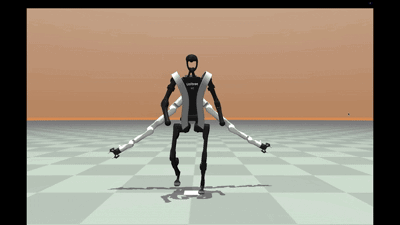

# **HuSLs (Display)**
> For the complete model and algorithm, please contact: bowen.zhi24@imperial.ac.uk
> A Hierarchical Framework for Humanoid Locomotion with Supernumerary Limbs (SLs)


This repository contains the code and configuration for training a deep reinforcement learning agent to enable a Unitree H1 humanoid robot, equipped with SLs, to perform stable locomotion. The project utilizes the MuJoCo physics simulator and the JAX framework for high-performance training.


## **1. Environment Setup**

Create Conda environment

```
conda create -n husls python=3.10
conda activate husls
```

Installing JAX and PyTorch manually

with CUDA (for example, CUDA 12):
```
# Install JAX for CUDA 12
pip install jax["cuda12"]

# Install PyTorch for CUDA 12
pip install torch torchvision torchaudio --index-url https://download.pytorch.org/whl/cu121
```

without CUDA (like Apple Silicon)
```
# Install JAX
pip install jax

# Install PyTorch
pip install torch torchvision torchaudio
```

Other necessary Python libraries
```
pip install -r requirements.txt
```


## **2. Training a New Agent**

The training process is handled by `experiment.py` and configured by conf.yaml. 

```
python experiment.py
```

The script will:

1. Log in to Weights & Biases (wandb) account to track the experiment.

2. Create the environment and the PPO agent based on conf.yaml.  

3. Begin the training process, which will take a significant amount of time (as defined by `total_timesteps`).  

4. Periodically save validation metrics and, upon completion, save the final trained agent state to a .pkl file in the outputs/ directory (e.g., `outputs/PPOJax_example.pkl`).

## **3. Evaluating a Trained Agent**

Once have a trained agent (.pkl file), `eval.py` can be used to visualize its performance.

Inside  `eval.py`, experiment scenarios can be selected by modifying the `env_name`.
```
# Set environment parameters
# config.experiment.env_params.env_name = "MjxUnitreeH1_human"
# config.experiment.env_params.env_name = "MjxUnitreeH1_static"
# config.experiment.env_params.env_name = "MjxUnitreeH1_balance"
```

To Run the Evaluation, execute the following command, replacing the path with the location of your trained agent file, for example:

```
python eval.py --path outputs/PPOJax_example.pkl
```



This evaluation script utilizes the "Mixed Control Mode". The responsibilities are clearly divided:

- **AI Agent**: Controls the complex, dynamic motion of the HuSLs system, mainly the locomotion from training, like walking.
- **Environment's PD Controller**: Overrides the AI's commands for the Supernumerary robotic limbs, forcing them to achieve and maintain the grasp-forward pose.

This ensures testing the AI's ability under a consistent, challenging load.

## **4. Experiment Information**

The `exp_info.py` can be used to get experiment information, including CoM (Center of Mass), humanoid's joint torques, grf (ground reaction forces), and distances between the humanoid's CoM and CoS (Center of Support).

To Run the Experiment, execute the following command, replacing the path with the location of your trained agent file, for example:

```
python exp_info.py --path outputs/PPOJax_example.pkl
```

Inside  `exp_info.py`, experiment scenarios can be selected by modifying the `env_name`.
```
# Set environment parameters
# config.experiment.env_params.env_name = "MjxUnitreeH1_human"
# config.experiment.env_params.env_name = "MjxUnitreeH1_static"
# config.experiment.env_params.env_name = "MjxUnitreeH1_balance"
```

### Data Recording

- C Key: Toggles the recording of the Center of Mass (CoM) trajectory.

- T Key: Toggles the recording of all joint Torques.

- F Key: Toggles the recording of ground reaction Forces (GRF) for each foot.

- D Key: Toggles the recording of the Distance between the robot's Center of Mass (CoM) and its Center of Support (CoS).

- A Key: Toggles recording for All data streams at once.


Baseline Humanoid running:


Humanoid with Static Payload running:


Humanoid with Dynamic Balancing running:


## **5. Flexible Framework**

The current framework is highly flexible, by adjusting the model definitions within the agent's code and tuning the corresponding hyperparameters, the framework can support more complex robot configurations, such as a humanoid equipped with a backpack containing 4 robotic arms.


